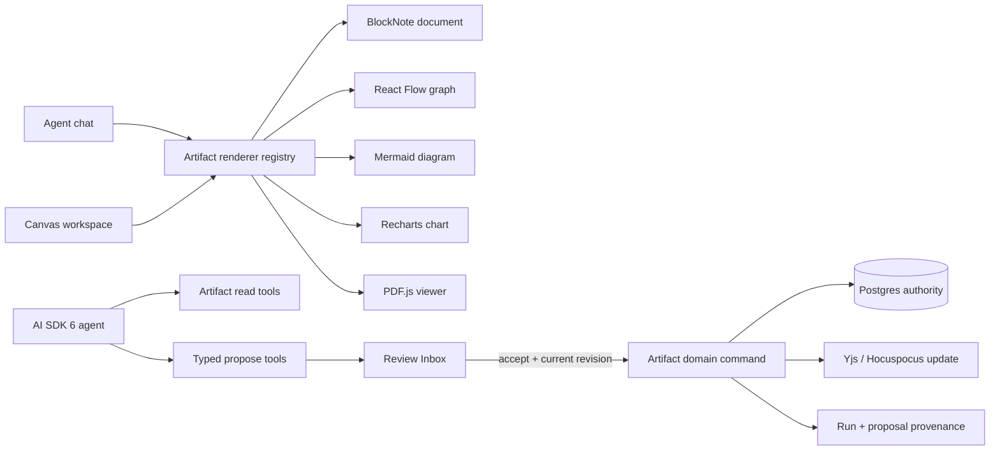

# Agent-editable workspace foundation

Feature: `agentic-canvas-foundation`  
Date: 2026-08-06  
Status: proposed for user approval  
Forge issue: `9a77ebc8-1b20-4634-8e93-5bcd920eac31`  
Classification: Critical — new artifact and agent-runtime architecture

## Executive decision

Build Canvas as a Product-Suite artifact workspace, not as one universal editor.
Each artifact keeps a native, versioned payload behind a small Product-Suite envelope,
typed semantic operations, one renderer registry, and the existing proposal/Review Inbox
authority path.

| Capability | MVP decision | Commitment |
| --- | --- | --- |
| Rich collaborative document | BlockNote Core + Shadcn + Yjs/Hocuspocus | Conditional GO after the vertical-slice gate below |
| Existing BlockSuite documents | Preserve read/migration compatibility | No new BlockSuite artifacts |
| Structured graph, dependency map, mind map | Existing React Flow | GO |
| Agent-authored diagrams | Existing Mermaid source and strict renderer | GO |
| Product/KPI charts | Existing `@product-suite/ui-charting` + Recharts v3 | GO |
| Uploaded PDFs | PDF.js read-only viewer; immutable original | GO |
| PDF mutation | Reviewed annotations and derived versions only | Defer `pdf-lib` operations until demanded |
| Sketch whiteboard | Excalidraw | Defer until freehand/wireframe demand is proven |
| Agent model/tool/UI layer | Existing AI SDK 6 | Keep for MVP |
| Agent durability | Existing Postgres `agent_runs`, threads, transcript, proposals | Keep authoritative |
| AI SDK 7 | Separate compatibility spike after artifact MVP | Do not block MVP |
| Cloudflare Workflows | Future queued/autonomous jobs only | Defer until crash-recovery need is measured |
| Cloudflare Agents/Durable Objects | Future resumable live agent sessions only | Defer |
| Cloudflare OS, Project Think, Code Mode, Computer, Eve, Mastra, LangGraph, OpenAI Agents | Reference patterns or future triggers | Do not adopt for MVP |

This is deliberately smaller than importing an agent OS or Notion clone. The current code
already has the useful foundations: AI SDK streaming, durable Postgres records, proposal
idempotency, Review Inbox consent, Yjs/Hocuspocus, Mermaid chat rendering, React Flow, and
Recharts.

## Purpose

Give users and agents one workspace where documents, diagrams, graphs, charts, and PDFs can
be created, viewed, revised, and discussed without allowing an agent to bypass tenant
authorization or human consent. The same artifact must render in Canvas and agent chat, and
every accepted mutation must retain provenance and support a compensating undo when the
artifact operation permits it.

## Success criteria

1. A canonical envelope supports `document`, `graph`, `diagram`, `chart`, and `pdf` without
   forcing their content into one universal schema.
2. Canvas and chat resolve artifacts through one renderer registry and lazy-load heavy engines.
3. The agent can read materialized semantic content and propose typed operations with a
   `baseRevision`; it cannot write Postgres, Yjs, Hocuspocus, or storage directly.
4. Review Inbox presents a stable before/after preview, rejects stale acceptance, applies an
   accepted proposal once, records actor/run/proposal provenance, and supports a documented
   compensating operation.
5. A BlockNote browser client and a backend Bun process round-trip the same Y.Doc through the
   existing Hocuspocus authorization and persistence boundary without private APIs or paid XL
   packages.
6. Mermaid stays in strict/sandbox mode; charts expose a data table/summary; PDFs preserve the
   uploaded original; all editor controls meet the defined keyboard and axe gates.
7. The MVP does not require Cloudflare Agents, Workflows, Sandbox, Computer, Cloudflare OS,
   Vercel Eve, Mastra, or another control plane.

## Out of scope

- A universal editor or universal JSON content format.
- Forking AFFiNE, AppFlowy, Outline, Docmost, Cloudflare OS, or another full product.
- Full PDF text editing, redaction, signing, or desktop-publishing fidelity.
- Freehand whiteboard collaboration in the first vertical slice.
- Agent-generated executable mini-apps or arbitrary production shell access.
- Migrating authoritative threads, memory, runs, proposals, or domain records into Durable
  Object SQLite or a framework-owned store.
- AI SDK 7 `WorkflowAgent`; it targets Vercel Workflow rather than Product-Suite's Cloudflare
  runtime.
- Automatic acceptance of agent mutations.

## Constraints

- Cloudflare-first deployment and portable model providers.
- Postgres remains the sole application authority for identity, runs, proposals, decisions,
  and domain data.
- Existing proposal write-first/flip-last semantics and tenant authority must not be weakened.
- Core dependencies must be open source and commercially usable without per-user/editor fees.
- Heavy editors and PDF viewers must be route- or artifact-lazy.
- Collaboration transport remains engine-neutral Yjs/Hocuspocus; agents use semantic commands,
  never raw Yjs binary updates.
- Existing BlockSuite data cannot be silently discarded.

## Edge cases and decisions

| Case | Decision |
| --- | --- |
| Human edits after agent reads | Reject accept when `baseRevision` is stale; offer regenerate/rebase, never blind apply |
| Two accepted proposals race | Repository idempotency key plus revision compare; exactly one domain command wins |
| Client disconnects during model stream | Current `waitUntil(consumeStream())` continues best-effort and durable rows expose incomplete/orphaned runs |
| Worker restarts mid-run | MVP records failure/orphan state; do not add a second runtime authority solely to hide it |
| Hocuspocus is unavailable | Local editing may continue only if the artifact records unsynced state; agent apply fails closed |
| Engine schema changes | Every payload has `schemaVersion`; migrations are pure, tested, sequential, and never run implicitly on agent input |
| Unsupported BlockNote content | BlockNote spike fails; use Tiptap Core + StarterKit + y-prosemirror behind the same contract |
| Existing BlockSuite content | Keep compatibility adapter and plan explicit export/migration; do not mix BlockSuite and BlockNote payloads under one kind/version |
| PDF modification requested | Create annotation or derived version; keep original immutable |
| Mermaid contains hostile markup | Validate source, pin patched Mermaid, render with `securityLevel: strict` or sandbox, sanitize exported SVG |
| Chart is inaccessible | Require title, description, textual summary, and data table alongside the visual |
| Sandbox/Computer unavailable | Product operations remain deterministic typed tools; arbitrary shell is not an MVP dependency |

## Ambiguity policy

Use the `/dev` seven-dimension decision rubric. Proceed and record the decision at at least 80%
confidence. Below 80%, stop the affected task and ask. A blocked optional engine must not block
unrelated artifact classes.

## Product-Suite architecture



### Artifact envelope

The envelope is shared; payloads and migrations are not.

```ts
type ArtifactKind = "document" | "graph" | "diagram" | "chart" | "pdf";

type ArtifactEnvelope<T> = {
  id: string;
  workspaceId: string;
  kind: ArtifactKind;
  schemaVersion: number;
  revision: number;
  title: string;
  content: T;
  createdBy: string;
  updatedBy: string;
  sourceRunId?: string;
  sourceProposalId?: string;
  createdAt: string;
  updatedAt: string;
};
```

MVP payloads:

- `document`: BlockNote block JSON materialization plus canonical Yjs state reference.
- `graph`: React Flow nodes, edges, and viewport.
- `diagram`: Mermaid source, title, description, and render-version metadata.
- `chart`: narrow Product-Suite spec over Recharts: metric, line, bar, area, or pie.
- `pdf`: immutable original object reference, metadata, annotations, and derived-version links.

### Semantic agent operations

- Document: `insert_blocks`, `replace_blocks`, `delete_blocks`.
- Graph: `upsert_nodes`, `upsert_edges`, `delete_nodes`, `delete_edges`.
- Diagram: `replace_source`.
- Chart: `replace_spec`.
- PDF: `add_annotation`, `create_derived_version` (deferred implementation).

Every operation includes artifact ID, `baseRevision`, validated payload, explanation, and
provenance. The model never sees storage credentials and never receives a raw mutation tool.

### Authority flow

1. Server resolves tenant/user and materializes the requested artifact.
2. AI SDK tool returns read-only semantic content.
3. Agent proposes typed operations; the proposal repository records them.
4. Canvas/chat render a deterministic preview from the proposal, not from model prose.
5. Accept rechecks tenant, permission, proposal state, artifact revision, and operation schema.
6. The artifact command applies once, persists the new revision, emits collaboration state,
   and only then closes the proposal according to the existing apply protocol.
7. Undo creates or executes a compensating domain operation; it never rewinds unrelated edits.

## Why not a universal editor

BlockSuite's shared Page/Edgeless model is attractive, but Product-Suite already has distinct
semantic classes and renderers. The local integration carries dynamic imports, custom-element
registration, AFFiNE schema setup, browser lifecycle persistence, timeouts, and full Yjs
snapshots. Upstream still describes BlockSuite as early-stage, and Product-Suite pins 0.19.5
while newer public releases have changed APIs. Concentrating documents, whiteboards, graphs,
and agent mutation on that engine increases migration and backend-mutation risk.

BlockNote is selected for a proof because its Core is MPL-2.0, its Shadcn integration fits the
existing UI, and `ServerBlockNoteEditor` explicitly converts BlockNote blocks and Yjs documents
server-side. Paid/GPL XL AI, column, and export packages are excluded. If the proof requires
private APIs or fails collaboration/server round-trips, Tiptap Core is the fallback.

## Runtime decision

The current agent runtime is the MVP winner.

- `apps/platform-api` already uses AI SDK `streamText`, an eight-step cap, request-independent
  runtime seams, tenant-owned thread headers, persistent `agent_runs`, transcript deltas, and
  propose-only tools.
- Review Inbox approval is a durable product decision, not a transient framework tool prompt.
- Adding Cloudflare Agents, Think, Eve, Mastra, or LangGraph now would duplicate session,
  workflow, memory, approval, or storage authority without fixing a current acceptance gap.

AI SDK 7 core is a later, isolated dependency migration for timeouts, telemetry, signed tool
approval primitives, and MCP Apps. Product-Suite proposals remain authoritative even after
that upgrade. Do not adopt `WorkflowAgent` on Cloudflare.

Cloudflare Workflows becomes justified only when queued autonomous runs must survive Worker
deployments/restarts. Such a workflow is keyed by the existing Postgres `agent_run.id`, retries
idempotent steps, and waits on the existing proposal decision. Cloudflare Agents/Durable
Objects become justified only when proactive or resumable live per-thread agents are measured
requirements. Neither may own application records.

Cloudflare OS contributes useful patterns—narrow capability introductions, sandboxed generated
apps, logged Gatekeepers, and deferred/bulk approval—but it is an early-access full product
shell. Eve is the strongest turnkey alternative if Cloudflare-first is abandoned, but its
production stack is Vercel-shaped. Both are references, not dependencies.

## Technical research

### Existing code to extend (DRY)

- `packages/ui-canvas/src/index.ts` already owns engine-neutral identity, storage, editor-mode,
  and collaboration-room helpers.
- `services/hocuspocus/src/index.ts` already owns generic Y.Doc room identity, authentication,
  load, and store hooks.
- `apps/roadmap-web/src/components/blocksuite/` is the compatibility source for existing
  BlockSuite persistence and export behavior.
- `packages/ui-chat/src/components/ai-elements/message.tsx` already renders Mermaid through
  Streamdown.
- `apps/platform-web` and `apps/roadmap-web` already use React Flow.
- `packages/ui-charting` and installed Recharts already cover the MVP chart renderer.
- `apps/platform-api/src/agent/tools.ts` already implements propose-only tools.
- `apps/platform-api/src/proposals/apply.ts` and `undo.ts` already own apply/compensation rules.
- `apps/platform-web/src/agent-chat/ProposalCard.tsx` and Review Inbox already expose the human
  decision surface.

### Required blast radius

The implementation is expected to touch contracts, DB schema/migration, artifact repository
and commands, proposal operation validation/apply/undo, agent tools, Canvas route/renderers,
chat proposal previews, Hocuspocus integration, and focused validation docs. It must not rename
or delete `blocksuite_documents` until compatibility/export evidence exists. Full-repo searches
for `blocksuite`, `canvasCoreContract`, `CanvasDocumentType`, proposal operation unions, and
route placeholders are required before replacement.

### Security and OWASP analysis

| Risk | Applies | Required mitigation |
| --- | --- | --- |
| Broken access control | Yes | Server-derived workspace/user; artifact ACL recheck on read, preview, accept, apply, and collaboration connect |
| Injection / unsafe output | Yes | Zod/contract validation; Mermaid strict/sandbox; sanitize SVG/HTML; parameterized persistence; no model-authored SQL |
| Insecure design | Yes | Read/propose/apply separation; capability-scoped tools; fail-closed stale fence |
| Security misconfiguration | Yes | No ambient storage/MCP credentials; route-lazy code; explicit CSP/iframe rules; pinned patched versions |
| Vulnerable components | Yes | License/advisory gate for editor, Mermaid, PDF.js, and PDF tooling |
| Identification/auth failures | Yes | Existing server auth plus Hocuspocus room authorization; no client-supplied actor identity |
| Software/data integrity failures | Yes | Versioned schemas/migrations, signed/immutable proposal evidence, deterministic preview, idempotency key |
| Logging/monitoring failures | Yes | Record actor, run, proposal, artifact revision, operation, outcome, and rejection reason without payload secrets |
| SSRF / arbitrary execution | Future | No MVP shell tool; sandbox egress deny-by-default and capability introductions if later added |
| Prompt/MCP injection | Yes | Tool output treated as untrusted; fixed typed tools for MVP; no Code Mode or broad MCP catalog |

### TDD scenarios

1. Happy path: agent proposes a document block insert at the current revision, Inbox previews
   it, user accepts, one new revision is persisted, both clients receive the Yjs update, and
   chat renders the result.
2. Failure path: human edits first; accepting the stale proposal returns a typed stale-revision
   result and leaves content/proposal authority unchanged.
3. Idempotency: the same accepted proposal is redriven after a timeout; no duplicate operation
   or revision is produced.
4. Authorization: a valid proposal ID from another workspace is unreadable and unapplyable.
5. Migration: a prior document payload migrates sequentially and preserves stable block IDs;
   unknown/future versions fail closed.
6. Collaboration outage: local unsynced state is visible; server-side agent apply fails without
   claiming success.
7. Renderer safety: hostile Mermaid and PDF metadata cannot execute script or external network
   requests.
8. Accessibility: document controls are keyboard operable; diagram/chart/PDF surfaces expose
   names, descriptions, summaries, and focus order.
9. Runtime regression: current AI SDK stream persists one run and one proposal through client
   disconnect; no framework migration is required.

## BlockNote vertical-slice gate

Time-box to two development days. GO only if all gates pass:

1. Core, React, Shadcn, and server-util run under current Bun/React 19 without private APIs or
   XL packages.
2. Two clients synchronize through existing Hocuspocus auth/load/store hooks and reload from
   persisted Yjs state.
3. A backend Bun process converts Y.Doc to blocks, applies one semantic operation, persists it,
   and both clients receive it without content loss.
4. Review Inbox stores typed operations plus `baseRevision`, renders a stable diff, applies once,
   and rejects stale acceptance.
5. JSON → Yjs → JSON plus chosen HTML/Markdown exports preserve the MVP block set.
6. Editor code is route-lazy and adds less than 10 KB gzip to the non-editor shell entry.
7. Axe has no serious/critical violations; keyboard and NVDA checks cover slash menu, formatting,
   headings, links, block movement, and collaboration status.

If gates 2–5 fail or require private BlockNote internals, use Tiptap Core + StarterKit +
y-prosemirror through the same artifact contract. Accessibility-only failure triggers a focused
BlockNote-versus-minimum-Tiptap UI comparison; it does not justify Lexical automatically.

## Licensing and cost

- BlockNote Core: MPL-2.0, free for closed-source commercial use. Exclude XL packages; current
  Business pricing is a license/support cost for those packages, not hosting.
- BlockSuite: MPL-2.0; compatibility only.
- React Flow, Mermaid, Recharts, Excalidraw, Tiptap Core, Lexical, and pdf-lib: permissive core
  licenses; verify exact versions in the dependency gate.
- PDF.js: Apache-2.0.
- AI SDK: Apache-2.0.
- Cloudflare OS: Apache-2.0; early access.
- Eve: Apache-2.0; Vercel-oriented production deployment.
- Current MVP adds editor bundle/storage/egress cost but no framework control-plane charge.
- If durability is later needed, Cloudflare Workers Paid starts at a small account minimum;
  Durable Objects charge compute/storage/requests and Workflows charge CPU, requests, retained
  state, and steps. Hibernation and short workflow retention must be part of any cost proof.

## Rejected alternatives

- **BlockSuite for all artifacts:** highest reuse today, but too much early-stage engine and
  migration risk at the exact backend-agent boundary that matters.
- **Build a bespoke editor:** duplicates mature block UX, collaboration, paste, table, and
  accessibility work.
- **Tiptap first:** strongest fallback and schema control, but more UI/product work than the MVP
  should own before BlockNote is disproven.
- **Lexical:** excellent low-level/a11y posture but too much Notion-style UX construction.
- **Excalidraw now:** solves sketching, not the MVP's structured agent-editable artifacts, and
  brings a second collaboration model.
- **Vega-Lite/ECharts/Plotly:** more expressive than current chart requirements; reuse Recharts.
- **Rich PDF editor:** the chosen open-source libraries do not edit arbitrary existing text.
- **Cloudflare Agents/Think now:** duplicate current thread/memory/run authority.
- **Cloudflare Workflows now:** current user-driven proposal flow does not require crash-resumable
  autonomous jobs.
- **Cloudflare OS or Eve:** full product/harness stacks that overlap Product-Suite.
- **Mastra/LangGraph/OpenAI Agents:** new orchestration abstractions without an MVP gap they alone
  solve.

## Source evidence

Primary external sources:

- BlockNote server processing: https://www.blocknotejs.org/docs/features/server-processing
- BlockNote collaboration: https://www.blocknotejs.org/docs/features/collaboration
- BlockNote Shadcn integration: https://www.blocknotejs.org/docs/getting-started/shadcn
- BlockNote licensing/pricing: https://www.blocknotejs.org/pricing
- BlockSuite project/status/license: https://github.com/toeverything/blocksuite
- React Flow JSON: https://reactflow.dev/api-reference/types/react-flow-json-object
- React Flow accessibility: https://reactflow.dev/learn/advanced-use/accessibility
- Mermaid accessibility: https://mermaid.js.org/config/accessibility.html
- PDF.js: https://mozilla.github.io/pdf.js/getting_started/
- pdf-lib limitations: https://github.com/Hopding/pdf-lib
- Cloudflare Agents: https://developers.cloudflare.com/agents/
- Cloudflare Think: https://developers.cloudflare.com/agents/harnesses/think/
- Cloudflare Code Mode: https://developers.cloudflare.com/agents/tools/codemode/
- Cloudflare Workflows: https://developers.cloudflare.com/workflows/
- Cloudflare Workflows pricing: https://developers.cloudflare.com/workflows/reference/pricing/
- Cloudflare OS: https://github.com/cloudflare/cloudflare-os
- Cloudflare Computer: https://github.com/cloudflare/computer
- AI SDK 7: https://vercel.com/blog/ai-sdk-7
- Vercel Eve: https://vercel.com/eve
- Mastra: https://mastra.ai/docs
- LangGraph persistence: https://docs.langchain.com/oss/javascript/langgraph/persistence
- OpenAI Agents JS: https://openai.github.io/openai-agents-js/

## Delivery sequence

1. Freeze the engine-neutral artifact contract and proposal operation contract.
2. Run the BlockNote vertical slice; choose BlockNote or activate the Tiptap fallback.
3. Add authoritative artifact persistence, migrations, revision fencing, apply, and undo.
4. Add the Canvas workspace and shared renderer registry.
5. Wire typed read/propose tools plus Canvas/chat/Inbox previews.
6. Add graph, Mermaid, chart, and read-only PDF artifact adapters using existing libraries first.
7. Validate security, accessibility, collaboration, performance, migrations, and existing
   BlockSuite compatibility.
8. Ship the artifact MVP on AI SDK 6.
9. Evaluate AI SDK 7 core as a separate non-blocking migration.
10. Measure crash-recovery requirements before filing a Cloudflare Workflows/Agents delivery
    plan.

