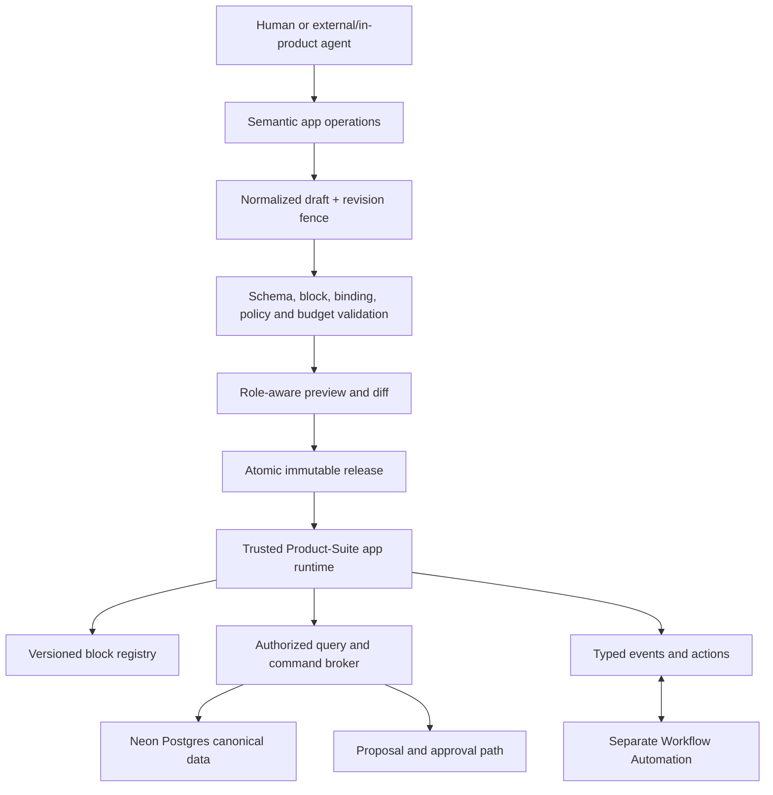

# Custom Mode internal-application platform

Feature: `custom-mode-platform`  
Date: 2026-08-07  
Status: architecture proposal for user approval; no implementation authorized  
Forge issue: `13307553-549e-4377-81ef-d0a7856f59d5`  
Classification: Critical - new application, data, permission, and extension architecture  
Research: [custom-mode-platform.md](../../research/custom-mode-platform.md)

## Executive decision

Custom Mode will be a Product-Suite-owned declarative internal-application platform. A person or
agent can define a team-specific product surface - navigation, pages, layouts, forms, boards,
documents, dashboards, data collections, permissions, and actions - without leaving Product-Suite.

We will not build the full platform during MVP. We will make today's block and artifact work obey
the contracts that keep this future possible, then add Custom Mode in bounded phases.

Product-Suite owns five durable contracts:

1. normalized application definition;
2. governed data/schema lifecycle;
3. block/component registry;
4. capability and permission evaluation;
5. draft, release, migration, and semantic agent operations.

An editor, realtime provider, MCP host, external coding agent, or future code sandbox is an adapter.
None becomes an authority for Product-Suite identity, data, permissions, releases, or audit.

## Purpose

Enable teams to build internal operational products such as onboarding systems, lightweight CRMs,
content pipelines, research hubs, approval desks, or project-specific workspaces from trusted
Product-Suite building blocks. Creation must be equally usable through direct manipulation,
in-product natural language, and external Codex/Claude/other CLI agents.

## Scope boundary

### Custom Mode owns

- app navigation, pages, layout trees, themes, and responsive presentation;
- trusted block instances, configuration, composition, and data bindings;
- custom collection schemas and records;
- app, page, collection, record, field, view, and action policies;
- direct user-invoked commands;
- drafts, previews, releases, migrations, installation, templates, and rollback;
- semantic operations exposed through Product-Suite API, MCP, CLI, and SDK.

### Workflow Automation owns separately

- event triggers, schedules, conditions, branches, background actions, retries, compensation,
  recurring execution, and workflow run history.

The boundary is typed events and actions. A Custom Mode button may invoke a workflow. A workflow
may mutate a governed record that a custom app displays. Neither system owns the other's model.

### Explicitly out of scope for the first Custom Mode release

- arbitrary JavaScript, npm packages, raw SQL, direct network access, or embedded secrets;
- a public marketplace or monetized third-party extension ecosystem;
- one database/schema/Worker per customer app;
- simultaneous CRDT editing of the entire app definition;
- a general workflow engine;
- replacing Product-Suite's identity, Run, proposal, audit, or artifact authorities;
- embedding or forking a complete low-code or Notion-like platform.

## Architecture



## Canonical application definition

`AppDefinitionV1` is a normalized, deterministic structure with stable IDs. YAML/JSON files are
lossless import/export projections; the server-normalized representation is authoritative.

```ts
type AppDefinitionV1 = {
  contractVersion: 1;
  appId: string;
  metadata: { name: string; description?: string; icon?: string };
  navigation: NavigationNode[];
  pages: PageDefinition[];
  collections: CollectionDefinition[];
  roles: AppRoleDefinition[];
  policies: PermissionPolicy[];
  actions: ActionReference[];
};
```

Rules:

- IDs survive rename, reorder, formatting, import/export, and agent edits.
- Layout, data schema, permissions, and secrets are separate logical sections even if one release
  snapshot contains them.
- Definitions contain no credentials, executable code, provider clients, rendered HTML, or runtime
  objects.
- Unknown future sections and block kinds are preserved losslessly but cannot execute until a
  compatible trusted definition is installed.
- Every mutation accepts `expectedRevision`; stale writes fail with a normalized diff/rebase path.

## Product-owned block contract

Blocks are reusable application components, not editor-specific nodes.

```ts
type BlockInstance = {
  id: string;
  kind: string;
  schemaVersion: number;
  revision: number;
  props: unknown;
  bindings: DataBinding[];
};

type BlockDefinition = {
  kind: string;
  currentVersion: number;
  decode(input: unknown): DecodeResult;
  migrate(from: number, input: unknown): MigrationResult;
  commands: CommandDefinition[];
  events: EventDefinition[];
  requiredCapabilities: Capability[];
  collaboration: "none" | "document";
  fallback: StructuredFallbackDefinition;
  exports: ExportDefinition[];
  accessibility: AccessibilityContract;
  budget: ResourceBudget;
};
```

### Mandatory compatibility rules

1. **Identity:** immutable instance ID, namespaced kind, schema version, and optimistic revision.
2. **Separation:** props, governed data bindings, transient view state, and collaborative document
   state are distinct.
3. **Validation:** decode every persisted payload at runtime; security-sensitive objects reject
   unknown fields.
4. **Migration:** deterministic sequential migrations, dry-run report, preserved original payload,
   and explicit unsupported-version fallback.
5. **Commands:** named typed domain commands or proposal intents; renderers never write domain data.
6. **Authorization:** server checks workspace, app, block, command, and bound-resource capability.
   A UI `readOnly` flag is not authorization.
7. **Fallback:** unknown, invalid, unavailable, or denied blocks render a safe accessible structured
   card and retain mandatory text/JSON export.
8. **Accessibility:** accessible name, reading order, native controls, focus/keyboard contract, and
   announced async/error state.
9. **Performance:** lazy heavy renderer, payload/node/row/file limits, visibility culling, and no
   eager editor dependency in the shell bundle.
10. **Portability:** canonical state never stores React elements, React Flow nodes, generated Mermaid
    HTML, chart instances, PDF executable content, editor objects, or provider IDs.

React Flow, Mermaid, Recharts, PDF tooling, and whichever document/canvas editor passes its own
acceptance spike implement block renderers behind this contract.

## Data bindings and commands

A binding names a governed source and projection rather than embedding mutable records:

```ts
type DataBinding = {
  id: string;
  source: { kind: "canonical" | "custom"; resource: string };
  query: TypedQuery;
  projection: string[];
  emptyState: string;
  maxRows: number;
};
```

- Queries use a typed allow-listed AST, never user SQL.
- Permission filtering occurs before data leaves the server, including exports and agent results.
- A block command resolves the same domain command used by human UI and agent proposals.
- An event contains typed identifiers and safe values; it does not carry secrets or hidden fields.
- Workflows consume only declared events and actions.

## Neon Postgres model

Neon is the verified platform database. New authority belongs in `packages/db`; Roadmap Supabase
remains a compatibility surface until separately migrated.

### First schema slice

Use the next free migration after the current chain. Do not reserve a number across parallel work.

#### `custom_apps`

- `id uuid`, `tenant_id text`, optional `team_id uuid`;
- `slug`, `name`, lifecycle status;
- bounded mutable `draft_definition jsonb` and `draft_revision bigint`;
- nullable current published version;
- standard provenance and timestamps;
- unique `(tenant_id, slug)` and `(tenant_id, id)`.

#### `custom_app_versions`

- tenant/app/version identity with composite tenant foreign key;
- immutable normalized definition and `manifest_lock jsonb`;
- parent version, change summary, content hash, publication provenance/time;
- unique `(tenant_id, app_id, version)`;
- published rows cannot be updated; rollback publishes a new version.

#### `custom_records`

- `id`, `tenant_id`, `app_id`, stable `entity_key`, and schema version;
- bounded validated `data jsonb` and optimistic `version bigint`;
- archive state, provenance, and timestamps;
- composite tenant/app foreign key;
- list index `(tenant_id, app_id, entity_key, archived, updated_at, id)`.

### Storage decisions

- Do not use EAV or create physical tables from user entity names in v1.
- Do not store files, rich document bytes, or large app definitions in record JSONB.
- Store relations in a separate tenant-fenced link table only when the first relationship feature
  ships; do not accept dangling IDs hidden in JSON as an authoritative relationship.
- Validate collection schema and record payload in the domain command before persistence.
- Cap field count, nesting, string/array size, definition bytes, record bytes, and query complexity.
- Use compare-and-set for draft and record updates.
- Start with composite list indexes and keyset pagination. Add targeted generated/expression indexes
  for measured fields; do not add a speculative catch-all GIN index.
- Apply and test every migration on an ephemeral or schema-only Neon branch before production.

### Migration ownership

The repository currently splits Alembic-owned tenancy/meeting tables from Drizzle-owned platform
tables. Custom Mode uses Drizzle migrations and composite foreign keys to the existing tenant/user
authority. It does not duplicate those tables. Snapshot-tail repair remains separate from a Custom
Mode migration; follow the current hand-authored SQL plus journal convention until that is resolved.

## Permission and capability model

Configurable permissions may narrow access or delegate authority already held by the publisher.
They can never grant authority the publisher lacks or weaken platform invariants.

### Capability layers

1. **Platform ceiling:** tenant isolation, identity, security, consent, audit, legal and resource
   policy. Immutable from Custom Mode.
2. **Workspace authority:** membership and workspace role.
3. **App role:** builder, publisher, data administrator, user, and custom audience roles.
4. **Resource grant:** app/page/collection/record/field/view/action.
5. **Condition:** a small allow-listed vocabulary such as own record, assigned user, member of team,
   or field equals current user. No arbitrary expression language in v1.

Authorization is deny-by-default and evaluated server-side for queries, commands, exports, agents,
and notifications. Hiding a block or field in the renderer is only presentation.

### Prerequisites

- Make the existing tenant resolver return role/capability context, not only active tenant IDs.
- Add composite tenant foreign keys so same-tenant relationships are structurally enforceable.
- Add `permission.simulate` and preview-as-role before app publishing.
- Keep an immutable platform-admin escape route so a broken custom app cannot lock out recovery.
- Consider Postgres RLS only after defining reliable per-request database identity; the current
  privileged Neon HTTP connection makes application authorization the primary boundary.

## Draft, release, and rollback

```text
semantic edit -> revision-fenced draft -> validate -> role preview -> reviewed diff
-> atomic immutable release -> install/pin -> observe -> rollback by new release
```

- Draft editing may be direct for authorized humans; agent changes default to draft/proposal.
- Publishing, schema destruction, and permission expansion require explicit capability and review.
- Releases lock block versions and schema versions so later upgrades cannot silently change behavior.
- Rollback never mutates history; it creates a new release pointing to prior normalized content.
- Published apps keep audit links to author, authorizing human, agent run, imported package hash, and
  approval.

Do not introduce CRDT for the whole definition initially. Optimistic revisions plus semantic merge
are simpler and auditable. Collaborative document blocks may continue using Yjs behind their block
contract.

## Agent, MCP, CLI, and file projection

The same semantic service powers UI, API, MCP, CLI, and SDK. No client receives a privileged path.

Core operations:

```text
app.get / app.validate / app.diff
page.add / page.rename / page.move
block.add / block.configure / block.move / block.remove
entity.add / field.add / field.rename / relation.add
binding.set
permission.grant / permission.revoke / permission.simulate
release.preview / release.publish / release.rollback
```

All writes support dry-run, idempotency, expected revision, normalized diff, and machine-readable
validation errors. External files are portable projections:

```text
app.yaml
schema.yaml
permissions.yaml
manifest.lock
```

Codex, Claude Code, or another agent may use the user's own local authentication to edit these
files and call scoped Product-Suite development tools. Import never applies to production directly.

## User experience

1. User asks: “Build an onboarding app for HR.”
2. Agent identifies whether existing blocks and canonical data are sufficient, asking only material
   questions about audience, data, and authority.
3. It creates a draft with sample data, visible assumptions, and stable object IDs.
4. Builder directly edits blocks, pages, fields, and bindings or continues by conversation.
5. Preview shows desktop/mobile and “view as role,” including denied and empty states.
6. Publish review shows schema changes, permission changes, commands/events, migration impact,
   resource budgets, and any external capability.
7. Release is installed for a team with an always-available admin escape route and rollback.

Natural-language changes must name commitment state accurately: drafted, proposed, published, or
applied. “Built” is not shown before a release succeeds.

## Security analysis

| OWASP area | Main risk | Required mitigation |
| --- | --- | --- |
| A01 Broken access control | UI-only field/row hiding, tenant predicate omission, privilege laundering. | Server capability broker, composite tenant FKs, deny default, policy simulation, adversarial tenant tests. |
| A02 Cryptographic failures | Secrets copied into manifests, logs, or exports. | Secret handles only; redaction; no credentials in app files or block props. |
| A03 Injection | User field names become SQL, expressions, Mermaid/HTML, or action parameters. | Typed ASTs, bound SQL values, stable internal keys, sanitized renderers, no arbitrary HTML/code. |
| A04 Insecure design | Duplicate authorities or direct renderer/agent writes. | One command path, revision fences, proposals, immutable releases, explicit workflow boundary. |
| A05 Misconfiguration | Published app locks out administrators or exposes data. | Preview-as-role, admin escape, publish checklist, secure defaults and kill switch. |
| A06 Vulnerable components | Executable/custom block supply-chain compromise. | Trusted registry, exact pins, manifest lock, integrity hash, deferred arbitrary code. |
| A07 Authentication failures | External CLI token crosses tenant/app scope. | Short-lived scoped tokens, user-bound grants, reauthorization for publish/privilege expansion. |
| A08 Integrity failures | Tampered import/package or nondeterministic migration. | Normalize, hash, sign where needed, deterministic migrations, immutable releases. |
| A09 Logging failures | No trace from agent edit to published behavior. | Append-only provenance linking actor, human, run, diff, approval, release, and rollback. |
| A10 SSRF | Future custom connector/code reaches arbitrary networks. | No network in v1; later outbound allow-list and isolated runtime. |

## Delivery phases

### Phase 0 - compatibility contracts during current MVP work

Do now where current block/artifact code is touched:

- stable artifact and block IDs, schema versions, revision fencing, and provenance;
- product-owned renderer/block registry interfaces;
- separation of props, bindings, transient view state, and collaborative document state;
- semantic commands and proposal intents rather than renderer or agent direct writes;
- structured fallback, accessibility, export, and resource budgets;
- provider-neutral persistence/realtime boundaries;
- tests that forbid editor/runtime objects and Supabase imports in shared contracts.

Do not add Custom Mode database tables, app builder UI, permission DSL, marketplace, or code runtime
to the MVP merely for future readiness.

### Phase 1 - declarative Custom Mode foundation after MVP

- Neon tables for app draft, immutable releases, and custom records;
- role-aware capability context and composite tenant constraints;
- trusted built-in block registry and deterministic app runtime;
- direct builder plus in-product agent semantic operations;
- preview-as-role, publish, rollback, and audit;
- two reference internal apps that exercise canonical and custom data.

### Phase 2 - governed data depth

- bounded relationships, formulas/rollups only where demanded;
- targeted indexes and query planner budgets;
- richer record/field conditions;
- import/export and templates;
- durable event/outbox or realtime only after cross-session demand is measured.

### Phase 3 - external developer ecosystem

- stable file format, MCP/CLI/SDK, local preview, fixtures, validation, compatibility matrix;
- external agent workflow using user-owned local auth;
- team template distribution, version pinning, deprecation, and support policy.

### Phase 4 - optional executable extensions

Only after declarative limits are demonstrated: sandbox UI/backend code, isolated secrets and
egress, CPU/memory/time budgets, signing, scanning, kill switch, and legal review. Cloudflare
Workers for Platforms is a candidate adapter, not a current dependency.

## Rejection gates

Reject a block or app design that:

1. lacks stable IDs, contract versions, revision fences, or deterministic migration;
2. stores operational records, permissions, or provider objects in Yjs/editor state;
3. lets a renderer, MCP client, agent, or workflow bypass the domain command and authorization path;
4. cannot render an accessible structured fallback or deterministic text/JSON export;
5. treats hidden UI as authorization or sends denied fields to the client;
6. creates SQL identifiers/tables from user names or accepts raw SQL/query expressions;
7. combines mutable schema, layout, permissions, secrets, and executable code without reviewable
   boundaries;
8. publishes with last-write-wins or upgrades a block version silently;
9. requires a router/sidebar entry per block or makes an editor framework the product schema;
10. needs arbitrary code before trusted blocks and typed commands demonstrably fail.

## Measurable success criteria

- A sample HR onboarding app can be represented without editor/runtime/vendor objects and round-trip
  through normalized JSON/YAML with all IDs preserved.
- UI and agent operations produce the same normalized diff and domain command.
- Stale draft/record updates are rejected in 100% of concurrency tests.
- Cross-tenant, denied-row, denied-field, denied-action, export, notification, and agent adversarial
  tests expose zero protected values.
- Every published release traces actor -> authorizing human -> optional Run -> diff -> approval ->
  immutable release and can roll back without rewriting history.
- Unknown or invalid blocks remain recoverable and render/export a safe structured fallback.
- A fresh Neon branch applies the complete migration chain and passes tenant, version, immutability,
  invalid-payload, and rollback contract tests.
- Baseline app load and interaction budgets are defined before implementation; heavy renderers are
  route/block lazy and bounded by declared row/node/file limits.
- Workflow Automation can consume a typed Custom Mode event and invoke a typed action without reading
  or mutating the app definition.

## TDD scenarios for the later implementation plan

1. Create a tenant-scoped draft, publish it, and render the immutable version.
2. Attempt a cross-tenant app, record, relation, export, and command access; every path denies without
   leaking names or field values.
3. Submit two edits with the same expected revision; exactly one succeeds and the other receives a
   rebaseable normalized diff.
4. Rename and reorder a page, entity, field, and block through YAML and UI; stable IDs and bindings
   survive.
5. Load an unknown block version; no code executes, payload is preserved, accessible fallback and
   text/JSON export remain available.
6. Publish a permission expansion without the publisher holding that capability; validation rejects it.
7. Change a custom field type with incompatible records; dry-run reports impact and publish blocks
   until migration is resolved.
8. Agent proposes a block command, human edits it, and acceptance rechecks tenant, permission,
   revision, binding snapshot, and idempotency before one durable mutation.
9. Complete migration chain on an isolated Neon branch, then validate rollback and no production
   impact.
10. Emit a declared app event to the separate workflow boundary and prove it cannot access undeclared
    fields or mutate the definition.

## Decisions requiring user approval before task decomposition

Recommended defaults:

1. Include bounded custom collections in Custom Mode v1, because canonical Product-Suite objects
   alone cannot express credible internal applications.
2. Use optimistic revisions, not whole-app CRDT, until simultaneous builder demand is measured.
3. Use application-layer capability enforcement first; design RLS separately after per-request Neon
   identity is reliable.
4. Permit trusted built-in blocks only in v1; defer arbitrary executable extensions.
5. Keep `AppDefinition` aligned with the Product-Suite artifact envelope rather than adding a new
   top-level product primitive.

After these are approved, `/plan` can produce the implementation task list. No `/dev` work is
authorized by this document.
