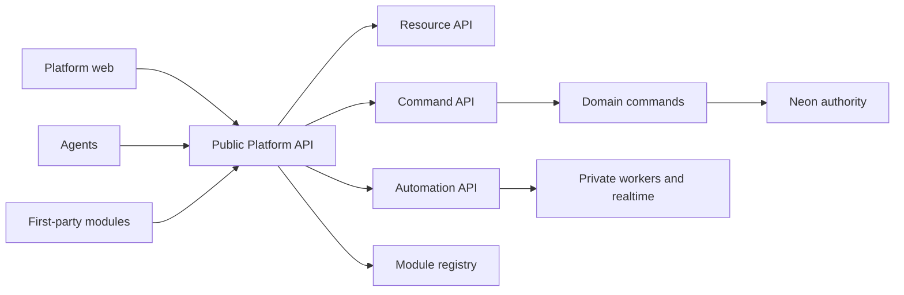

# Agent-native Product-Suite control plane

## Feature

Make the Platform API the single public control plane used by the web application,
agents, and trusted first-party modules. Product behavior is expressed as resources,
capabilities, and commands; no agent or module controls the product by manipulating
the DOM or bypassing domain write paths.

Forge epic: `fb7233b1-e825-4713-8663-77c03dde2dde`.

## Locked product decisions

- `apps/platform-api` remains the sole public API. Meeting processing, agent
  execution, realtime, and future infrastructure adapters stay private.
- The public product surfaces are Resource, Command, Automation, and Module APIs.
- Canonical membership roles are exactly `viewer`, `member`, `admin`, and `owner`.
  Canonical migration `0020_canonical_membership_roles` enforces that contract. There
  is no production data and no `org_admin` compatibility alias or backfill design.
  Missing, inactive, malformed, and unknown roles deny by default.
- Capability semantics start with `read`, `edit`, and `configure`:
  - `viewer`: `read`
  - `member`: `read`, `edit`
  - `admin`, `owner`: `read`, `edit`, `configure`
- The server derives tenant, actor, role, and on-behalf-of authority. Client body or
  agent input is never an authority source.
- Every command mutation eventually requires a capability decision, idempotency key,
  expected resource version, request ID, audit event, and approval when sensitive.
- Sensitive execution must match a preview hash; drift returns `409` and requires a
  fresh preview.
- Canvas blocks store references and layout only. Business data remains in canonical
  resources and changes through the Command API.
- MVP modules are trusted, first-party, manifest-only registrations. Arbitrary code,
  installation, a marketplace, module-owned migrations, and third-party execution are
  deferred until signing, isolation, approval, and sandboxing exist.
- Cloudflare cutover is not an early milestone. Core product verticals and rollback
  parity land first; Railway remains rollback-only until cutover evidence is complete.
- Legacy applications and provider-specific code are removed only after feature,
  data, authorization, accessibility, observability, and rollback parity plus two
  successful releases.

## Technical Research

### Current-state findings

- `apps/platform-api/src/app.ts` already provides one authenticated Hono API, but its
  routes are unversioned and cover only part of the desired control plane.
- `apps/platform-api/src/auth/tenant-scope.ts` resolves active tenant IDs and the
  internal user ID, but not the membership role or capability decision.
- Team creation, status creation, and project create/update enforce tenant membership
  but not role-based configuration authority.
- Proposal application already has useful exactly-once and stale-snapshot behavior,
  but it is not a reusable versioned command contract. Work-item `expectedVersion`
  cannot be authoritative until the resource has a real version/CAS field.
- The public SDK currently exposes only the Meeting client, and there is no `modules/`
  registry.
- Existing audit/provenance and proposal domain paths are foundations to adapt, not
  parallel systems to replace or bypass.

### Product and API patterns adopted

- Stripe: replay-safe idempotency and predictable, machine-readable errors.
- GitHub Apps: explicit, granular capabilities with deny-by-default expansion.
- Slack: portable, versioned manifests for module identity and permissions.
- Notion: schema-driven resources that remain understandable to humans and tools.
- Shopify: signed, retryable, replayable webhook delivery with observable failures.
- MCP: discoverable tools generated from the same capability registry as the API.

These are contract patterns, not new vendor dependencies. The implementation remains
provider-neutral and keeps Neon as relational authority.

### TDD scenarios that span the program

1. Happy path: an admin previews a work-item command, executes the identical preview,
   receives the durable result, and sees the same audit event in the web timeline.
2. Failure path: a member attempts a configuration command and receives a stable `403`
   without an idempotency, audit-success, or domain-write artifact.
3. Edge path: an agent retries the same idempotency key after a network loss and gets
   the original result; changing the request or using a stale version returns `409`.
4. Module path: a first-party manifest requests a known capability and is discoverable;
   an unknown capability or unapproved expansion is rejected before registration.
5. Tenant path: a valid resource ID from another tenant remains indistinguishable from
   an unknown resource and never leaks existence.

## Delivery architecture

The capability registry is the shared contract spine. The web UI, SDK, agent-tool
schemas, documentation, and module discovery consume the same versioned definitions.
No surface hand-maintains a competing command schema.

## Medium PR sequence

### CP0 — Capability context and protected configuration writes

Forge issue: `af872dc9-3c53-4f9d-9fc0-3e0bbdf6889f`.

Add a provider-neutral, deny-by-default capability resolver over active membership.
Protect team creation and status creation with `configure`; protect project create and
update with the explicitly documented `edit` policy. Unknown tenant/resource stays
`404`; a known active member lacking capability receives `403`. Because there is no
production data, add a database role constraint/enum if it is the cleanest authority
model rather than preserving unconstrained legacy text.

### CP1 — Versioned command kernel vertical

Forge issue: `0f825242-6214-4661-81c4-28f878123b15`.

Add `/api/v1` command preview/execute contracts for work-item create/update and
proposal apply. Persist resource version/CAS, idempotency results, request/audit
metadata, and preview hashes. Human UI and accepted agent proposals use the same
command registry and domain write path. Add SDK methods and a stable error envelope.
This PR owns canonical migration `0021` and must preserve and advance the exact
`0018`/`0019`/`0020` topology, harness, evidence, and readiness contracts. It never
applies a production migration. Because there is no production data, it adds no
compatibility or backfill path. Do not add generic CRUD, a generic workflow engine,
or arbitrary module execution.

### CP2 — Governed command UX

Forge issue: `8e80ca7c-cf37-4d5f-9309-f50cb56f3450`.

Move the first web mutation verticals onto preview/execute. Present the change diff,
human-readable permission, approval state, retryability, request ID, result, and the
unified human/agent/module activity timeline. This PR owns the one affected E2E flow.

### CP3 — First-party manifest-only module registry

Forge issue: `0c9250aa-2b34-49be-a85f-54ee00327fb4`.

Register Workboard and Meeting manifests declaring identity/version, resources,
commands, agent tools, views/canvas blocks, JSON schemas, permissions, and events.
Discovery is data-only; module implementations remain statically trusted and lazily
loaded. Permission expansion is explicit and reviewable.

### CP4 — Generated discovery, SDK, agent tools, and API documentation

Forge issue: `cfb7ed68-32db-4503-9b0e-dee1284d4bed`.

Generate discovery payloads, SDK metadata, agent-tool schemas, and API documentation
from the approved registry and command contracts. A contract hash and drift test make
duplicate hand-authored schemas fail closed.

## Independent Meeting lane

Meeting authority remains separate from CP0–CP4. It starts only after the existing
human-gated production Neon preflight/apply/reconciliation succeeds. Then deliver at
most two medium PRs: server authority, followed by Add/Adjust/Dismiss UI plus E2E.
Do not create a dependency from the control-plane program to the human deployment
gate; the lanes may progress independently until Meeting integration is required.

## Mutation contract

Every command request and persisted outcome carries:

- exact tenant/workspace and server-derived actor;
- optional on-behalf-of principal with an auditable delegation chain;
- capability and approval decision;
- idempotency key bound to actor, command, workspace, and canonical request hash;
- expected resource version and atomic compare-and-swap;
- request ID and stable machine error code;
- preview hash for sensitive commands;
- append-only audit event with before/after or compensating-command metadata.

For CP1, `work-item.create` and `work-item.update` require the server-derived CP0
`edit` capability. A directly authenticated human actor may execute them without a
sensitive approval, and request bodies may not supply delegation or `onBehalfOf`.
Agent-proposed mutations execute only through `proposal.apply`.

`proposal.apply` derives its target command and capability from the stored proposal.
The stored accepted/approved proposal is the server-side approval source. Execution
binds the server-derived actor and tenant to the stored proposal snapshot, expected
resource version, and preview hash, while recording the proposing agent as
server-derived `onBehalfOf` provenance. Request bodies cannot supply tenant, actor,
role, approval, or delegation, and the command surface exposes no arbitrary
delegation mechanism.

Duplicate retries return the original terminal result. The same idempotency key with a
different request hash fails. Stale versions and preview drift fail with `409` before a
write. Cross-tenant targets are indistinguishable from missing resources (`404`), and
a known caller lacking the required capability receives `403`. The domain write,
version compare-and-swap, idempotency terminal result, and audit event commit in one
transaction or not at all. Existing domain commands remain the mutation authority.

## Performance contracts

- Useful screen: `<= 2 s` p75 on normal 4G.
- Cached route transition: `<= 150 ms` p75.
- Interaction latency: `<= 100 ms` INP for local feedback.
- API reads: `<= 200 ms` p95, excluding explicitly asynchronous jobs.
- Command acknowledgement: `<= 300 ms` p95; work exceeding that becomes resumable
  asynchronous execution.
- Initial shell: `<= 250 KB` gzip; each initial module chunk `<= 100 KB` gzip and
  lazy-loaded.
- Canvas: 60 FPS target with viewport rendering and a `16.7 ms` frame budget.
- Lists over 20 rows require pagination/virtualization; route query-count budgets and
  N+1 regression checks are mandatory.
- Cheap CI feedback target: `<= 6 min`. Protected database work starts only after
  exact-head cheap gates and targets `<= 15 min`.

## Delivery and ownership rules

- One medium PR has one autonomous end-to-end owner: claim, RED/GREEN, focused
  validation, pre-PR CodeRabbit CLI, push, CI/review correction, stable green, and
  human merge handoff.
- The orchestrator owns dependency order, exact-base refresh, conflict integration,
  final risk decision, and post-merge verification; it does not co-edit an owned PR.
- Review is batched once per exact head after local gates. Use one independent reviewer
  for CP0/CP2/CP3/CP4 and at most security plus data-integrity reviewers for CP1.
- Run CodeRabbit CLI before the first push and once after the final local correction;
  do not start repeated reviewer swarms.
- Tests are change-aware: static/coupling first, affected lint/types/unit next, one E2E
  owner, protected DB last, always-run sentinel. Never duplicate the same suite in
  both an app workflow and DB Contract.
- Merge sequentially. After each human merge, refresh `origin/main`, rebase the next
  owner onto the exact new base, rerun only invalidated gates, require all review
  threads resolved, and observe the requested 10-minute exact-head stable-green
  window before handoff.

## Retirement checkpoints

- `roadmap-web` and `packages/ui-planning`: retire after Workboard route/API,
  read-write, permissions, bookmark/deep-link, accessibility, and rollback parity plus
  two releases.
- `meeting-web`: retire after Meeting routes, stream, review/promotion UX, E2E parity,
  rollback proof, and two releases.
- BlockSuite remnants: remove only after the reference canvas renderer/export path has
  parity.
- Supabase-specific runtime/config: remove after Neon production authority, fresh
  bootstrap, and zero runtime references are proven.
- Railway: remove after Cloudflare parity, canary, rollback drill, observability, and
  two releases.
- Hocuspocus: remove only after provider-neutral realtime conformance and migration/
  rollback proof.

## Failure and security cases

- Unknown, inactive, or ambiguous membership denies before mutation.
- Body-supplied tenant, actor, role, capability, or approval is ignored/rejected.
- Duplicate idempotency key with different canonical input is a conflict.
- Stale resource version or preview hash is a conflict with no partial write.
- Audit/idempotency persistence participates in the same transaction as the command.
- Failed async work is resumable and cannot report success without a durable outcome.
- Webhooks require signing, retry policy, replay protection, and a dead-letter path.
- Agents receive compact capability-scoped context and never unrestricted DB or
  infrastructure credentials.
- Module manifests start with no permissions; unknown capabilities and permission
  expansion fail closed.

## Out of scope for the first five PRs

- Cloudflare production cutover or Railway removal.
- Marketplace, arbitrary third-party modules, dynamic code loading, or module-owned
  migrations.
- Generic resource CRUD or a generic workflow/runtime engine.
- CP2 command UI, E2E coverage, or the activity timeline in CP1.
- Production migration execution or compatibility/backfill design.
- Full mobile canvas or offline-first editing; mobile initially supports review and
  approval flows.
- Legacy retirement before the explicit checkpoints above.

## Success criteria

The program is successful when the web UI and an agent can discover and safely execute
the same versioned work-item commands through the public Platform API; capability,
idempotency, version, preview, approval, and audit invariants are proven; first-party
modules declare capabilities without arbitrary execution; generated SDK/tool/docs
surfaces cannot drift; performance budgets are measured; and legacy retirement remains
gated by parity rather than schedule pressure.
